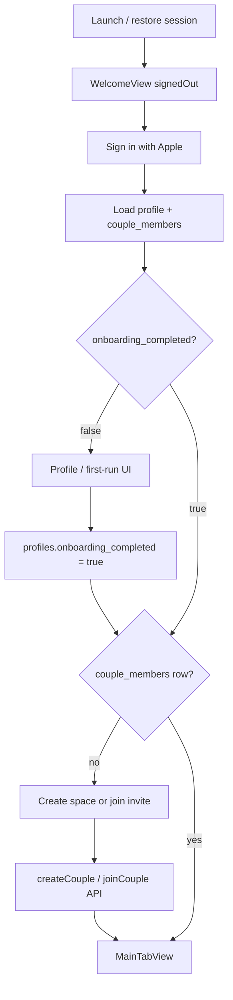

# iOS Starter Spec — alignment with Ruffles backend

Use this alongside the **Ruffles iOS — Starter Spec** (splash, icon, welcome, Sign in with Apple). The starter spec is correct for **UI and Apple auth mechanics**; this doc fixes **database, routing, and API** so native and web share one Supabase project.

**Canonical backend reference:** [`NATIVE_IOS_SUPABASE.md`](NATIVE_IOS_SUPABASE.md)

---

## Do not run Starter Spec §5 (`public.users`)

The starter spec’s SQL creates `public.users` with fields that **do not exist** in production Ruffles. Running it will either fail (table/trigger conflict) or fork your data model away from web.

| Starter spec | Use instead (Ruffles) |
|----------------|----------------------|
| `public.users` | **`public.profiles`** |
| `partner_user_id` on user | **`couple_members`** + **`couples`** (max 2 members) |
| `users.is_pro` | **`couples.is_pro`** |
| `saves_used_this_month` on user | Count **`drafts`** where `plan_id IS NULL` and `source_url` is set (monthly); see web [`pricing.ts`](../apps/web/src/lib/pricing.ts) |
| `users.ics_token` | **`ics_feed_tokens`** (one row per user) |
| New `handle_new_user` → `users` | Existing trigger → **`profiles`** + **`notification_preferences`** (migrations **001**, **007**) |

### SQL to run (cloud Supabase)

Run migrations **in order** only — no greenfield `users` table:

1. [`001_initial.sql`](../supabase/migrations/001_initial.sql) through [`006_ruffles_item_types.sql`](../supabase/migrations/006_ruffles_item_types.sql)
2. [`007_profiles_ios_onboarding.sql`](../supabase/migrations/007_profiles_ios_onboarding.sql) — adds `profiles.onboarding_completed`, `updated_at`, unified sign-up trigger

If the project already has 001–006, run **only 007** in the SQL Editor.

---

## Fix `AuthManager` — table name

Starter spec updates `public.users`. Change to **`profiles`**:

```swift
// After Apple sign-in, if display name was provided (first sign-in only)
try? await supabase
  .from("profiles")
  .update(["display_name": displayName])
  .eq("id", value: session.user.id.uuidString)
  .execute()
```

`handle_new_user` already creates the `profiles` row on sign-up; this update only fills name when Apple returns it once.

---

## Post-login routing (required)

Starter spec: `signedIn` → `MainTabView` → Plans empty state.

**Actual requirement:** user must belong to a **couple** before Home/Plans data works (same as web [`getUserContext`](../apps/web/src/lib/user-context.ts) and `/onboarding`).



### Suggested `AuthState`

```swift
enum AuthState: Equatable {
  case loading
  case signedOut
  case signedInNeedsCouple   // session OK, no couple_members
  case signedIn              // session + couple — show MainTabView
}
```

| State | Screen |
|-------|--------|
| `loading` | `LaunchView` (session restore) |
| `signedOut` | `WelcomeView` |
| `signedInNeedsCouple` | `CoupleSetupView` — “Start our space” / paste invite / open universal link |
| `signedIn` | `MainTabView` |

**`createCouple` / `joinCouple`:** cannot be done with service role on device. Call a **Supabase Edge Function** or **thin REST API** on your web host that validates the user JWT and runs the same logic as [`createCouple` / `joinCouple`](../apps/web/src/app/actions.ts). See [NATIVE_IOS_SUPABASE.md §7](NATIVE_IOS_SUPABASE.md#7-direct-supabase-vs-backend-required).

**Deep links:** `{APP_URL}/join/{invite_token}` — after Apple sign-in, call join API with token from URL. Invite token lives on `couples.invite_token` (readable via RLS when member; join itself is server-side).

---

## What stays as-is from the starter spec

| Area | Verdict |
|------|---------|
| App Store icon 1024×1024, cream `#FAF7F2`, mark `#E54B2A` | Aligned with web brand |
| Launch screen static, no animation | Correct (Apple HIG) |
| Welcome copy + `SignInWithAppleButton` | Good |
| Nonce: SHA-256 to Apple, raw to Supabase | Correct — do not shortcut |
| `Config.xcconfig` + Info.plist for `SUPABASE_URL` / `SUPABASE_ANON_KEY` | Good — see [`Secrets.xcconfig.example`](Secrets.xcconfig.example) |
| Anthropic only via Edge, never in app | Correct |
| SPM `supabase-swift` | Correct |
| Test Sign in with Apple on **real device** first | Correct |

---

## Small spec tweaks

### Terms and Privacy URLs

Starter spec uses `https://ruffles.app/terms` and `/privacy`. Host real pages at your production **`APP_URL`** before App Review, or update URLs in `WelcomeView` to match deployed routes.

### Tab bar

| Starter spec | Web app today |
|--------------|----------------|
| Home / Plans / You | **Settings** / Home / Plans / You |

Decide v1 iOS tabs; Settings can hold ICS subscribe URL, invite, Pro status (mirror web [`settings/page.tsx`](../apps/web/src/app/(app)/settings/page.tsx)).

### Config file naming

Starter spec: `Ruffles/Config.xcconfig`. Repo template: [`docs/Secrets.xcconfig.example`](Secrets.xcconfig.example) — same keys (`SUPABASE_URL`, `SUPABASE_ANON_KEY`, optional `APP_URL`).

### Serif font

Cooper BT requires a license. Acceptable v1 fallback: **New York** (system): `.font(.custom("NewYork-Bold", size: 32))`.

---

## Couple onboarding API (live on web deploy)

Use these after Sign in with Apple. Base URL: `APP_URL` from xcconfig.

| Route | Body | Response |
|-------|------|----------|
| `POST /api/ios/create-couple` | `{ "name"?: string }` | `{ "coupleId": "uuid" }` |
| `POST /api/ios/join-couple` | `{ "inviteToken": string }` | `{ "coupleId": "uuid" }` |

**Header:** `Authorization: Bearer <supabase session access token>`

Full details: [NATIVE_IOS_SUPABASE.md §7](NATIVE_IOS_SUPABASE.md#ios-rest-api-implemented)

## Still to plan (post-couple)

| Route | Replaces web | Secrets |
|-------|--------------|---------|
| `ingest-link` | `ingestLinkCore` | `ANTHROPIC_API_KEY` (destination detect) |
| voice / smart-plan (future) | actions | Anthropic |

---

## iOS implementation checklist

- [ ] Migrations **001–007** applied (never `public.users`)
- [ ] `AuthManager` uses **`profiles`**, not `users`
- [ ] `RootView` includes **`signedInNeedsCouple`** + `CoupleSetupView`
- [x] `createCouple` / `joinCouple` via `POST /api/ios/create-couple` and `join-couple`
- [ ] Optional: set `profiles.onboarding_completed` after first-run UI
- [ ] Universal Links for `/join/*`
- [ ] Assets: AppIcon, LaunchLogo, LaunchBackground, LogoMark
- [ ] Sign in with Apple capability + Supabase Apple provider (Services ID ≠ Bundle ID)

---

## After welcome lands (product order)

Matches starter spec §10, with couple gate inserted:

1. **CoupleSetupView** + join/create API
2. **MainTabView** shell
3. **PlansEmptyView** + teaching sheet (web: [`PlansEmptyState`](../apps/web/src/components/plans/PlansEmptyState.tsx))
4. **CreateTripFlow** (Where / When / Who)
5. **TripDetailView** / wishlist
6. Share extension (same `drafts` / `plans` model)

---

## Quick reference: `profiles` row

| Column | iOS usage |
|--------|-----------|
| `id` | Same as `auth.users.id` |
| `display_name` | Header, partner row; set from Apple on first sign-in |
| `avatar_url` | Optional; web uses OAuth avatar |
| `onboarding_completed` | Native first-run gate (007) |
| `created_at`, `updated_at` | Metadata |

Pro, reel limits, and partner link are **not** on `profiles` — see `couples`, `couple_members`, `drafts` in [NATIVE_IOS_SUPABASE.md](NATIVE_IOS_SUPABASE.md).
