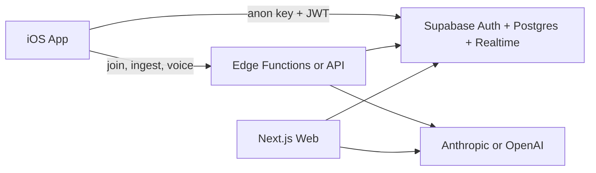

# Ruffles — Native iOS + Supabase

Handoff reference for building the native iOS app against the same backend as the web app (`apps/web`). There is no `apps/ios` folder yet — this doc is the starting point.

---

## 1. What Ruffles is

**Ruffles** (repo: `timewellspent`) is a **couples shared calendar and trip planner**.

| Loop | Description |
|------|-------------|
| **Save reels** | Paste IG/TikTok links → saved as `drafts` in your **inbox** (tagged by destination) |
| **Match** | When both partners save the same URL, it surfaces as a match |
| **Plan trips** | Create trips (Where → When → Who), wishlist view, smart day planning |
| **Voice** | Talk through a trip → AI proposes events → confirm to calendar |
| **Subscribe** | Per-user `.ics` feed for Apple Calendar / Google Calendar |

**Data hierarchy:**

```
auth.users
  └── profiles
        └── couple_members ──► couples
                                  ├── plans
                                  ├── events
                                  ├── drafts
                                  └── todos
```

**MVP paywall** ([`apps/web/src/lib/pricing.ts`](../apps/web/src/lib/pricing.ts)):

- **15 free inbox reel saves per month** (`plan_id` is null, has `source_url`)
- Saves directly onto a trip do **not** count toward the limit
- **Pro** (`couples.is_pro`): unlimited inbox saves — checkout not wired yet on web

**Web stack:** Next.js 16 on Vercel, Supabase Auth + Postgres + Realtime. See [`README.md`](../README.md) for production setup.

### Architecture (recommended for iOS)

**Hybrid** — best UX for users: native speed for CRUD, server for secrets and AI.



| Layer | Use for |
|-------|---------|
| **Supabase Swift SDK** | Plans, events, drafts, todos, profiles, realtime, Pro flag |
| **Edge Functions or thin API** | `createCouple`, `joinCouple`, link ingest AI, voice → events |
| **Universal links** | `https://APP_URL/join/{invite_token}` (same as web) |

---

## 2. Supabase project setup

### 2.1 Cloud project

1. Create a project at [supabase.com](https://supabase.com).
2. **SQL Editor** → run migrations **in order**:

| # | File | What it adds |
|---|------|----------------|
| 1 | [`supabase/migrations/001_initial.sql`](../supabase/migrations/001_initial.sql) | Core tables, RLS, `handle_new_user` trigger, realtime on `events` |
| 2 | [`supabase/migrations/002_profiles_rls.sql`](../supabase/migrations/002_profiles_rls.sql) | Profile + notification insert policies |
| 3 | [`supabase/migrations/003_event_ai_meta.sql`](../supabase/migrations/003_event_ai_meta.sql) | Event `confidence`, `needs_confirmation`; plan `day_themes` |
| 4 | [`supabase/migrations/004_profiles_couple_read.sql`](../supabase/migrations/004_profiles_couple_read.sql) | Partner can read co-member `profiles` |
| 5 | [`supabase/migrations/005_plans_wishlist.sql`](../supabase/migrations/005_plans_wishlist.sql) | `is_pro`, plan wishlist fields, draft `plan_id` |
| 6 | [`supabase/migrations/006_ruffles_item_types.sql`](../supabase/migrations/006_ruffles_item_types.sql) | Draft matching, event `item_type` / tags |
| 7 | [`supabase/migrations/007_profiles_ios_onboarding.sql`](../supabase/migrations/007_profiles_ios_onboarding.sql) | `onboarding_completed`, `updated_at`, unified `handle_new_user` |

3. **Authentication → Providers:** enable **Google** and **Apple**.
4. **Authentication → URL configuration → Redirect URLs:**
   - `https://YOUR-VERCEL-DOMAIN/auth/callback` (web)
   - `http://localhost:3000/auth/callback` (local web)
   - `ruffles://auth/callback` (iOS custom scheme — adjust to your bundle)
5. Copy **Project URL**, **anon (public) key**, and **service_role key** (server only).

### 2.2 Local Supabase (optional)

Requires Docker. Config: [`supabase/config.toml`](../supabase/config.toml) (`project_id = "ruffles"`).

| Service | Port |
|---------|------|
| API | 54321 |
| Postgres | 54322 |
| Studio | 54323 |

### 2.3 Google OAuth (if using Google sign-in on iOS)

- **Google Cloud:** create an **iOS** OAuth client (bundle ID) and keep the **Web** client for Supabase callback.
- **Supabase redirect URI (Google):** `https://YOUR-PROJECT-REF.supabase.co/auth/v1/callback`
- Web optionally requests Calendar scopes; iOS can omit them for v1.

### 2.4 Apple Sign In

- **Apple Developer:** App ID with Sign in with Apple; Services ID for web/OAuth if needed.
- **Supabase → Apple provider:** Team ID, Key ID, Services ID, `.p8` private key.
- Add your iOS **bundle ID** to the Apple provider configuration.

---

## 3. Schema reference

Types mirror [`apps/web/src/lib/types.ts`](../apps/web/src/lib/types.ts).

### `profiles`

| Column | Type | Notes |
|--------|------|-------|
| `id` | uuid PK | FK → `auth.users` |
| `display_name` | text | From OAuth metadata on signup |
| `avatar_url` | text | Web partner header / OAuth |
| `onboarding_completed` | boolean | Native first-run UI (007); default `false` |
| `created_at` | timestamptz | |
| `updated_at` | timestamptz | Auto-updated on row change (007) |

Auto-created by trigger `handle_new_user` on `auth.users` insert (OAuth name/avatar + `notification_preferences`).

**Onboarding gates (web + iOS):**

| Check | Meaning |
|-------|---------|
| `onboarding_completed = true` | User finished profile / first-run screens (set from iOS or web when you add that step) |
| `couple_members` row exists | User has a shared calendar — required for Home / Plans on web |

iOS can use both: show profile onboarding until `onboarding_completed`, then `createCouple` / `joinCouple` until `couple_members` exists. Do **not** replace the existing table or RLS with a greenfield iOS-only `profiles` script — use migration **007** only.

### `couples`

| Column | Type | Notes |
|--------|------|-------|
| `id` | uuid PK | |
| `name` | text | e.g. "Our plans" |
| `invite_token` | text unique | Hex token for `/join/{token}` |
| `created_by` | uuid | FK → `profiles` |
| `is_pro` | boolean | Migration 005; MVP Pro gate |
| `created_at` | timestamptz | |

### `couple_members`

| Column | Type | Notes |
|--------|------|-------|
| `couple_id` | uuid | PK part 1 |
| `user_id` | uuid | PK part 2 → `profiles` |
| `role` | text | Default `member` |
| `joined_at` | timestamptz | |

Max **2 members** per couple (enforced in app logic, not DB).

### `plans`

| Column | Type | Notes |
|--------|------|-------|
| `id` | uuid PK | |
| `couple_id` | uuid | |
| `slug` | text | Unique per couple; URL segment `/plans/{slug}` |
| `title` | text | |
| `destination` | text | Display name |
| `destination_key` | text | Stable key; unique per couple when set (005) |
| `status` | text | `building` \| `scheduled` |
| `date_mode` | text | `flexible_month` \| `exact` |
| `flexible_month` | text | `yyyy-MM` when flexible |
| `starts_on` / `ends_on` | date | Exact mode |
| `trip_length_days` | int | |
| `day_themes` | jsonb | Per-day `{ title, subtitle }` |
| `description`, `cover_image_url`, `vibe`, `is_template` | | |

### `events`

| Column | Type | Notes |
|--------|------|-------|
| `id` | uuid PK | |
| `couple_id` | uuid | |
| `plan_id` | uuid nullable | |
| `created_by` | uuid | |
| `scope` | text | **`us`** \| **`mine`** \| **`theirs`** |
| `category` | text | meal, coffee, activity, travel, lodging, other |
| `title`, `description` | text | |
| `starts_at`, `ends_at` | timestamptz | |
| `timezone` | text | Default `America/Los_Angeles` |
| `place_name`, `address`, `location_lat`, `location_lng` | | |
| `cost_cents`, `cost_is_free`, `hours_label`, `notes`, `bring_items` | | |
| `confidence`, `needs_confirmation` | | AI metadata (003) |
| `item_type`, `tags`, `estimated_cost`, `source_type`, `source_text`, `external_url` | | 006 |
| `legacy_uid` | text | ICS import dedup |
| `sort_order`, `completed_at` | | |

**Realtime:** `events` is on `supabase_realtime` publication (migration 001).

### `drafts`

| Column | Type | Notes |
|--------|------|-------|
| `id` | uuid PK | |
| `couple_id` | uuid | |
| `plan_id` | uuid nullable | **`null` = inbox** (counts toward reel limit) |
| `created_by` | uuid | |
| `source_url` | text | IG/TikTok/etc. |
| `source_type` | text | `paste`, `instagram`, `tiktok` |
| `title`, `place_name` | text | |
| `status` | text | `draft`, `enriched`, `scheduled` |
| `suggested_day` | date | Wishlist placement |
| `sort_order` | int | |
| `raw_metadata` | jsonb | AI detection payload |
| `matched_at`, `match_partner_draft_id` | | Partner match (006) |

### `todos`

Simple couple task list: `id`, `couple_id`, `created_by`, `title`, `completed_at`.

### `ics_feed_tokens`

| Column | Type | Notes |
|--------|------|-------|
| `user_id` | uuid PK | |
| `token` | text unique | Public feed segment |
| `rotated_at` | timestamptz | |

Feed URL: `{APP_URL}/api/feed/{token}.ics`

### `notification_preferences`

Per-user: `email_on_us_events` (default true).

---

## 4. Row Level Security (RLS)

All public tables use RLS. Helper:

```sql
-- Returns couple_id(s) for auth.uid()
public.user_couple_ids()
```

### Policy summary

| Table | Access |
|-------|--------|
| `profiles` | Select/update own; select co-members (004) |
| `couples` | Select/update if member; insert if authenticated (`created_by = auth.uid()`) |
| `couple_members` | Select same couple; insert self (`user_id = auth.uid()`) |
| `plans` | All operations if `couple_id` in `user_couple_ids()` |
| `events` | Select all member events; insert as member; update/delete if `scope = 'us'` OR `created_by = auth.uid()` |
| `drafts` | All if member; insert requires `created_by = auth.uid()` |
| `todos` | All if member |
| `ics_feed_tokens` | Own row only |
| `notification_preferences` | Own row only |

**Implication for iOS:** With the **anon key** and a logged-in user's JWT, PostgREST enforces couple isolation. You do **not** need the service role for normal CRUD.

---

## 5. Authentication (iOS)

### Web reference flow

1. [`SplashSlide.tsx`](../apps/web/src/components/SplashSlide.tsx) — `signInWithOAuth` (Google / Apple)
2. Redirect to `/auth/callback?code=...`
3. [`auth/callback/route.ts`](../apps/web/src/app/auth/callback/route.ts) — `exchangeCodeForSession`
4. Onboarding → `createCouple` or `joinCouple`

### iOS with [supabase-swift](https://github.com/supabase/supabase-swift)

**Dependencies (SPM):** `Supabase` package from `supabase/supabase-swift`.

**Initialize:**

```swift
import Supabase

let supabase = SupabaseClient(
  supabaseURL: URL(string: Config.supabaseURL)!,
  supabaseKey: Config.supabaseAnonKey
)
```

**Sign in with Apple (recommended primary):**

```swift
// After ASAuthorizationController returns identityToken + nonce:
try await supabase.auth.signInWithIdToken(
  credentials: .init(
    provider: .apple,
    idToken: idToken,
    nonce: nonce
  )
)
```

**Google:** `signInWithOAuth(provider: .google)` with `redirectTo: URL(string: "ruffles://auth/callback")` and handle the URL in `onOpenURL`, **or** Google Sign-In SDK + id token exchange.

**Session:** SDK stores refresh token (Keychain). Listen with `supabase.auth.authStateChanges`.

**Load user context** (equivalent to [`getUserContext`](../apps/web/src/lib/user-context.ts)):

```swift
struct UserContext {
  let userId: UUID
  let coupleId: UUID
  let profile: Profile
  let partner: Profile?
  let isPro: Bool
}

// 1. supabase.auth.session.user.id
// 2. SELECT * FROM profiles WHERE id = userId
// 3. SELECT couple_id FROM couple_members WHERE user_id = userId
// 4. SELECT user_id, profiles(*) FROM couple_members WHERE couple_id = ?
// 5. SELECT is_pro FROM couples WHERE id = coupleId
```

**Onboarding:**

- `profiles.onboarding_completed = false` → show native first-run / profile UI, then `update` to `true`.
- No `couple_members` row → call backend **`createCouple`** (see §7).
- Pending invite in deep link → **`joinCouple(inviteToken)`** after auth.

```swift
try await supabase
  .from("profiles")
  .update(["onboarding_completed": true])
  .eq("id", value: userId.uuidString)
  .execute()
```

**Sign out:** `try await supabase.auth.signOut()`

---

## 6. Secrets and environment variables

See [`Secrets.xcconfig.example`](Secrets.xcconfig.example) for Xcode template.

### Safe to embed in the iOS app (public by design)

These are the same values as web `NEXT_PUBLIC_*` variables. They are extractable from the app binary; security comes from **RLS + user JWT**, not hiding the anon key.

| iOS / xcconfig | Web equivalent | Example |
|----------------|----------------|---------|
| `SUPABASE_URL` | `NEXT_PUBLIC_SUPABASE_URL` | `https://xxxx.supabase.co` |
| `SUPABASE_ANON_KEY` | `NEXT_PUBLIC_SUPABASE_ANON_KEY` | `eyJhbG...` (anon JWT) |
| `APP_URL` | `NEXT_PUBLIC_APP_URL` | `https://timewellspent-calendar.vercel.app` |
| `MAPS_API_KEY` (optional) | `NEXT_PUBLIC_MAPS_KEY` | Google Maps SDK only |

### Never ship on iOS

| Secret | Used for |
|--------|----------|
| `SUPABASE_SERVICE_ROLE_KEY` | Bypasses RLS — [`createServiceClient`](../apps/web/src/lib/supabase/server.ts), ICS feed, `createCouple` / `joinCouple`, Joshua Tree sync |
| `ANTHROPIC_API_KEY` | Link destination, smart plan, voice, day AI |
| `OPENAI_API_KEY` | Voice fallback |
| `RESEND_API_KEY` / `RESEND_FROM_EMAIL` | Email |
| `RUFFLES_DEMO_PRO` | Server-side Pro bypass for demos |
| `RUFFLES_LINK_INGEST` | Server feature flag |

Store these in **Vercel**, **Supabase Edge Function secrets**, or **CI only**.

### OAuth credentials (dashboard only, not in git)

| Provider | Where |
|----------|--------|
| **Apple** | Team ID, Key ID, Services ID, `.p8` key → Supabase Apple provider |
| **Google** | iOS client ID (bundle ID) + Web client ID/secret → Supabase Google provider |

---

## 7. Direct Supabase vs backend required

### iOS can call Supabase directly (authenticated client)

| Feature | Operation |
|---------|-----------|
| List / read plans | `from("plans").select().eq("couple_id", ...)` |
| Create plan | `insert` — match [`createPlan`](../apps/web/src/app/actions.ts) fields; use unique `slug` / `destination_key` pattern |
| Update plan settings | `update` on `plans` |
| Events CRUD | `events` insert/update/delete per RLS |
| Drafts CRUD | `drafts` — inbox = `plan_id IS NULL` |
| Todos | `todos` |
| Partner profile | `profiles` select (couple policy) |
| Pro status | `couples.is_pro` |
| Inbox save count | Count `drafts` where `plan_id` is null, `source_url` not null, `created_at` >= start of month |
| Realtime | Subscribe to `events` changes for `couple_id` |
| ICS token read | `ics_feed_tokens` own row — build subscribe URL client-side |

**Inbox draft without AI:** If the user picks destination manually, `insert` into `drafts` is allowed. Enforce **15/month** in the app using the count query + `couples.is_pro` (mirror [`canSaveReel`](../apps/web/src/lib/pricing.ts)).

### Requires Edge Function or API (server secrets / service role)

| Operation | Web entry | Why |
|-----------|-----------|-----|
| **createCouple** | [`createCouple`](../apps/web/src/app/actions.ts) | Service role: profile bootstrap, couple + member + ICS token, optional Joshua Tree seed |
| **joinCouple** | [`joinCouple`](../apps/web/src/app/actions.ts) | Service role: merge solo couples, move plans/events |
| **ingestLink** (AI) | [`ingestLink`](../apps/web/src/app/actions.ts) | [`ANTHROPIC_API_KEY`](../apps/web/src/lib/link-destination.ts) for destination detection |
| **parseVoiceTranscript** | actions | AI |
| **confirmProposedEvents** | actions | Batch insert with validation |
| **smartPlan** / **planThisDay** | actions | AI |
| **ICS feed generation** | [`GET /api/feed/{token}.ics`](../apps/web/src/app/api/feed/[token]/route.ts) | Service role resolves token → couple events |

### iOS REST API (implemented)

Base URL: `{NEXT_PUBLIC_APP_URL}` (same as web). Send the Supabase **access token** from `session.accessToken` after Sign in with Apple.

**Headers (both routes):**

```
Authorization: Bearer <supabase_access_jwt>
Content-Type: application/json
```

#### `POST /api/ios/create-couple`

Creates a couple space (idempotent if the user already has one).

**Body (optional):**

```json
{ "name": "Our plans" }
```

**Success `200`:**

```json
{ "coupleId": "uuid" }
```

**Implementation:** [`apps/web/src/app/api/ios/create-couple/route.ts`](../apps/web/src/app/api/ios/create-couple/route.ts) → [`createCoupleCore`](../apps/web/src/lib/couple-onboarding.ts)

#### `POST /api/ios/join-couple`

Joins an existing couple via invite token (from `/join/{token}` link).

**Body:**

```json
{ "inviteToken": "hex-from-invite-url" }
```

**Success `200`:**

```json
{ "coupleId": "uuid" }
```

**Implementation:** [`apps/web/src/app/api/ios/join-couple/route.ts`](../apps/web/src/app/api/ios/join-couple/route.ts) → [`joinCoupleCore`](../apps/web/src/lib/couple-onboarding.ts)

**HTTP errors:**

| Status | Meaning |
|--------|---------|
| `401` | Missing or invalid Bearer token |
| `400` | Validation or business error (`error` string in JSON) |
| `500` | Unexpected server error |

**Swift example:**

```swift
var request = URLRequest(url: URL(string: "\(Config.appURL)/api/ios/join-couple")!)
request.httpMethod = "POST"
request.setValue("Bearer \(session.accessToken)", forHTTPHeaderField: "Authorization")
request.setValue("application/json", forHTTPHeaderField: "Content-Type")
request.httpBody = try JSONEncoder().encode(["inviteToken": token])
```

#### `POST /api/ios/ingest-link`

Saves a reel/link with the same logic as web `ingestLink` (auto-route to matching trip, partner match, inbox cap).

**Body:**

```json
{
  "sourceUrl": "https://…",
  "title": "optional",
  "planId": "optional uuid",
  "destination": "optional override",
  "destinationKey": "optional",
  "forceInbox": false
}
```

**Success `200`:** `{ needsDestination, inbox, autoRouted, planId, planSlug, planTitle, draftId, matched }` or `{ needsDestination: true, sourceUrl, sourceType }`.

**Implementation:** [`apps/web/src/app/api/ios/ingest-link/route.ts`](../apps/web/src/app/api/ios/ingest-link/route.ts) → [`ingestLinkCore`](../apps/web/src/lib/link-ingest-core.ts)

**Still planned:** voice ingest, smart-plan iOS API — use Edge or additional `/api/ios/*` routes later.

**Error codes to handle (client):**

- `SAVE_LIMIT_REACHED` — inbox reel cap (16th save); show Pro upsell
- `Invalid invite` / invite full — partner join failures

---

## 8. Public HTTP endpoints

No Supabase session required:

```
GET {APP_URL}/api/feed/{token}.ics
```

- `token` from `ics_feed_tokens.token` for the signed-in user
- Returns `text/calendar` for the couple's shared events (partner-aware filtering server-side)

---

## 9. Deep links and invites

**Invite URL format** ([`joinInviteUrl`](../apps/web/src/lib/app-url.ts)):

```
{APP_URL}/join/{invite_token}
```

Example: `https://timewellspent-calendar.vercel.app/join/a1b2c3...`

**iOS setup:**

1. **Universal Links** — `apple-app-site-association` on `APP_URL` for `/join/*`
2. **Custom URL scheme** — `ruffles://join/{token}` as fallback
3. After sign-in, call **`joinCouple`** via API with the token from the path

**Couple `invite_token`:** Read from `couples` where user is a member (select allowed by RLS).

---

## 10. iOS development acceleration checklist

### MVP slices (in order)

1. **Auth + UserContext** — Apple sign-in, load profile + couple + partner + `is_pro`
2. **Plans list** — mirror [`PlansHub`](../apps/web/src/components/plans/PlansHub.tsx); empty state + teaching sheet optional
3. **Plan detail** — wishlist [`PlanWishlistView`](../apps/web/src/components/plans/PlanWishlistView.tsx)
4. **Create trip** — 3-step flow [`CreateTripFlow`](../apps/web/src/components/plans/create-trip/CreateTripFlow.tsx); insert `plans` via Supabase
5. **Inbox + paste link** — API for `ingestLink`; handle paywall
6. **Invite** — share link; universal link → join API
7. **Voice** — defer, WebView `/record`, or native speech + API

### Code reuse

| Source | iOS |
|--------|-----|
| [`apps/web/src/lib/types.ts`](../apps/web/src/lib/types.ts) | Swift `Codable` structs (snake_case keys match DB) |
| [`pricing.ts`](../apps/web/src/lib/pricing.ts) | `FREE_INBOX_REEL_SAVES_PER_MONTH = 15` |
| Brand | `#E54B2A` (`primary-500`) |

### Supabase dashboard checklist

- [ ] Run migrations 001–007
- [ ] Enable Apple + Google providers
- [ ] Add iOS redirect URL (`ruffles://auth/callback`)
- [ ] Add bundle ID to Apple provider
- [ ] Confirm Realtime enabled for `events` (migration 001)

### Example: inbox save count (Swift)

```swift
let startOfMonth = Calendar.current.date(from: Calendar.current.dateComponents(
  [.year, .month], from: Date()))!

let count = try await supabase
  .from("drafts")
  .select("id", head: true, count: .exact)
  .eq("couple_id", value: coupleId.uuidString)
  .is("plan_id", value: nil)
  .not("source_url", operator: .is, value: "null")
  .gte("created_at", value: ISO8601DateFormatter().string(from: startOfMonth))
  .execute()
  .count ?? 0
```

### Example: create plan (Swift)

Mirror web `createPlan` — unique slug per insert:

```swift
try await supabase.from("plans").insert([
  "couple_id": coupleId.uuidString,
  "slug": uniqueSlug,
  "title": destination,
  "destination": destination,
  "destination_key": uniqueSlug, // web uses slug as destination_key for uniqueness
  "status": "building",
  "date_mode": dateMode,
  "flexible_month": flexibleMonth,
  "starts_on": startsOn,
  "ends_on": endsOn,
  "trip_length_days": tripLengthDays
]).execute()
```

---

## 11. Security notes

- **Anon key in the app is expected.** Do not use it without a user session for couple data.
- **Never embed `SUPABASE_SERVICE_ROLE_KEY`.** Rotate immediately if leaked.
- Store auth refresh tokens in **Keychain** (Supabase Swift SDK default).
- Validate **`invite_token`** on the server for `joinCouple` (do not trust client-only joins across couples).
- Rate-limit sensitive API routes on the backend.

---

## 12. Web server actions reference

Full list in [`apps/web/src/app/actions.ts`](../apps/web/src/app/actions.ts) for parity when building APIs:

| Action | Purpose |
|--------|---------|
| `createCouple` | Onboarding bootstrap |
| `joinCouple` | Accept invite |
| `createPlan` | New trip |
| `ingestLink` | Save reel / link |
| `getInboxReelSaveCount` | Paywall meter |
| `createEvent` / `updateEvent` / `deleteEvent` | Calendar CRUD |
| `parseVoiceTranscript` / `confirmProposedEvents` | Voice loop |
| `smartPlan` / `planThisDay` | AI planning |
| `getMatchedDrafts` | Partner link matches |
| `rotateIcsToken` | Regenerate feed URL |

---

## 13. Out of scope (this doc)

- App Store Connect / TestFlight
- RevenueCat / in-app Pro purchase (web upgrade sheet is informational only)
- Push notifications (not on web yet)
- Google Places autocomplete

---

## 14. iOS Starter Spec alignment

If your team is following the **Ruffles iOS — Starter Spec** (splash, App Store icon, welcome, Sign in with Apple), read **[`IOS_STARTER_SPEC_ALIGNMENT.md`](IOS_STARTER_SPEC_ALIGNMENT.md)** before running any SQL from that doc.

**Critical corrections:**

| Starter spec | Use this repo instead |
|--------------|------------------------|
| `CREATE TABLE public.users` (§5) | **Do not create.** Use `profiles`, `couples`, `couple_members` (migrations 001–007) |
| `AuthManager` → `.from("users")` | `.from("profiles")` |
| `signedIn` → `MainTabView` immediately | Add **`signedInNeedsCouple`** until `createCouple` / `joinCouple` (API or Edge Function) |
| `is_pro` / saves on user row | `couples.is_pro`; inbox saves = count `drafts` with `plan_id IS NULL` |

**Welcome → main app flow:**

```text
Sign in with Apple → restore session
  → optional: profiles.onboarding_completed
  → require: couple_members (createCouple / joinCouple via backend)
  → MainTabView → Plans empty state / Create Trip
```

UI pieces from the starter spec (launch screen, welcome, colors, nonce, xcconfig) are aligned; only the **data model and post-auth routing** need the changes above.

---

## Related files

| Path | Description |
|------|-------------|
| [`docs/IOS_STARTER_SPEC_ALIGNMENT.md`](IOS_STARTER_SPEC_ALIGNMENT.md) | Starter spec vs Ruffles backend (users table, routing, checklist) |
| [`docs/Secrets.xcconfig.example`](Secrets.xcconfig.example) | Xcode config template |
| [`README.md`](../README.md) | Web deploy + env vars |
| [`supabase/migrations/`](../supabase/migrations/) | SQL migrations |
